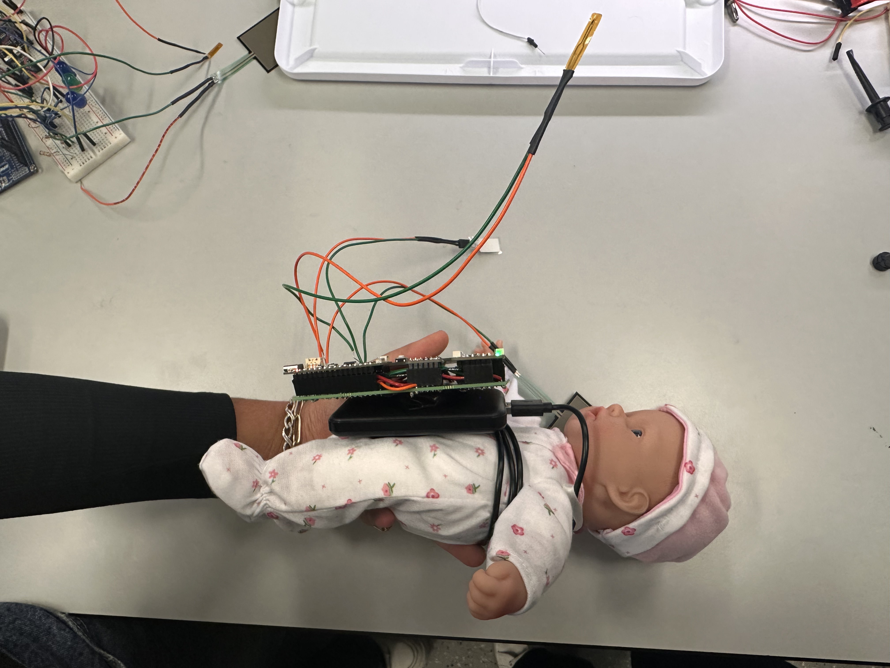
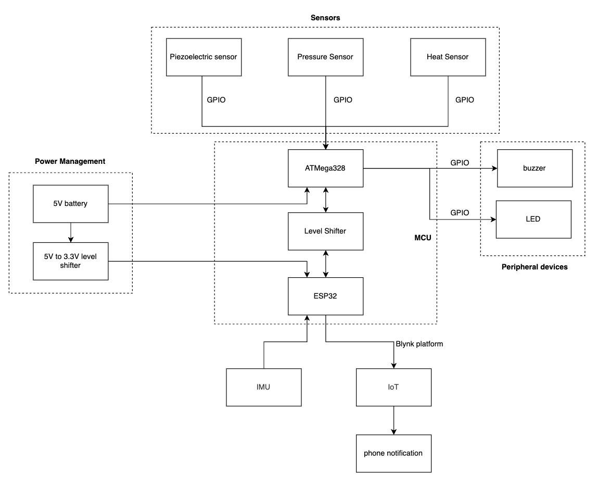

# ssuhaila23.github.io
Baby monitor device that can monitor indicators of SIDS and alert parents if their baby is distressed while asleep. 

Group 10: Arushi Mittal, Ashley Tang, Suhaila Shankar

Description: Baby monitor to detect harmful conditions such as high/low temperature, incorrect position, high/low pressure. or altered breathing.

[Github Repository URL](https://github.com/upenn-embedded/final-project-sids-shield)

Description of Hardware: Macbook M1 Chip, Atmega 328PB, ESP32 Feather Board, level shifter, IMU sensor, Piezoelectric Sensor, Pressure Sensor, Thermistor, Buzzer, LED

### 1. Video and Images

[Final Demo Video](https://drive.google.com/file/d/17rNR9tPgFV4sAJj6qu6tA6vn5GGB3a_y/view?usp=sharing)

### 2. Project Description

SIDS Shield is a device that helps parents prevent Sudden Infant Death Syndrome (SIDS) by detecting and notifying when unsafe sleep practices occur, such as stomach sleeping, sleeping on soft bedding, overheating, and more. It uses sensors such as IMUs (Intertial Measurement Unit), temperature sensors, and pressure sensors to detect dangerous sleeping conditions, and notifies parents of these conditions according to level of danger. 

#### 2.1 Motivation

Sudden Infant Death Syndrome (SIDS) causes over 1,000 deaths in the US each year, and even more deaths occur due to accidental suffocation or strangulation in bed. Though SIDS is not fully understood, many theories revolving around an infant's quality of sleep are said to affect this condition. Factors such as sleeping on their stomach, sleeping on very soft surfaces, overheating during sleep, and more are predicted to be causes of SIDS. In order to solve this problem, we will create a device that can monitor indicators of SIDS and alert parents if their baby is distressed while asleep. 

### 3. Device and Requirements

We have a pressure sensor that can determine if the baby is on a hard, soft, or optimal surface. We also have a thermistor to detect and notify if the baby's temperature is too hot or cold. An IMU is used to detect for if the baby flips over. A piezoelectric sensor is used to detect the rise and fall of a baby's chest and hence its breathing patterns. This system has been integrated with LEDs that light up to give a warning sign if a condition is not optimal. We also have the Blynk notification system set up to give mobile alerts for potential risks for the baby. Our project successfully meets the hardware and software requirements. We also used a pcb board to solder the components and ensure that the module is lightweight to be incorporated into a babysuit.

#### 3.1 Software Requirements Specification (SRS) Results

Based on your quantified system performance, comment on how you achieved or fell short of your expected software requirements. You should be quantifying this, using measurement tools to collect data.

* (SRS 01): This SRS indicates that a notification shall be triggered when a baby has been flipped within 5 seconds, and this has been met (the notification is triggered when the baby is flipped, immediately). Our tests have been successful and the notification is sent within a second because flipping the baby causes a negative IMU value. 
* (SRS 02): This SRS defines how the temperature sensor will function, and can alert if baby is not within optimal temperature of between 97.5-99.7 degrees Celsius. 
* (SRS 03): Pressure sensor is able to detect if baby is on soft surface or hard bench. On mattress or a pack of cotton balls the sensor lights and shows that the baby is on a surface that is too soft. On the lab table, the device shows that the baby is at an optimal pressure.
* (SRS 04): This SRS indicates that a notification will be triggered if the baby does not breathe for 5 cycles. Approximately 5 seconds have been used for the 5 breathes and the LED blinks if the piezoelectric does not decrease below a certain voltage to indicate breathing. Our circuit setup has been fixed because we were originally using an op amp to add a gain. However, the piezoelectric generates a voltage, so we did not need an op amp or low pass filter to process the output from the piezoelectric.

#### 3.2 Hardware Requirements Specification (HRS) Results

Based on your quantified system performance, comment on how you achieved or fell short of your expected hardware requirements. You should be quantifying this, using measurement tools to collect data. 

* (HRS 01): An IMU sensor has been implemented with the ability to detect if a baby is facing upwards or downwards with more than 80% accuracy. 
* (HRS 02): A temperature sensor has been implemented with the ability to measure in the ranges of 80℉ -120℉ with at least 95% accuracy.
* (HRS 03): A pressure sensor has been implemented and tests must be done to determine if it can sense weight of baby.
* (HRS 04): A piezoelectric sensor has been implemented to detect baby's breathing. Bottom of piezoelectric sensor is more sensitive than top, so configuration would be ideal if bottom portion of the sensor moves for baby's breathing.

We met our hardware requirements which included using an IMU sensor to detect if the baby flips over, using a thermistor to monitor baby's body temperature, pressure sensor to monitor baby's bed, and piezoelectric to monitor breathing. Our piezoelectric currently measures changes in voltage to detect if the sensor is not moving and shows that the baby has stopped breathing. However, this requires the sensor to be moving with the baby's body which may only give a small change and trigger alerts even though the baby is breathing.

#### 3.3 System Block Diagram 

#### 3.4 Project Complexity

* (Timers): Timers are used to generate a periodic signal for the buzzer and the timer is set to CTC mode and toggles the buzzer's pin when the buzzer is active. 
* (ADC): The temperature, pressure and piezoelectric sensors use ADC pins to convert the analog signal to a digital value and the values are used to control the LEDs which light up if the value is out of the optimal range. 
* (Wireless Communication): We used wireless communication and the Blynk notification app to send notifications if the baby is flipped over, not breathing, or is experiencing an unsafe temperature or pressure. We used an ESP32 Feather board and Arduino to notify Blynk if a sensor detected a harmful condition for the baby. 
  
### 4. Conclusion and Next Steps

#### 4.1 Challenges

* (Piezoelectric Sensor): We first thought that we needed an op amp to amplify the signal, but we realized that the piezoelectric uses force to convert to a voltage so we do not need an external voltage supply.
* (Integration): We are glad that we kept the breadboard version of our circuit and used new components when soldering the circuit onto our protoboard. This helped us debug the circuit if certain parts of the circuit did not work. We learned how to debug code when integrating different components and hardware debugging such as using an oscilloscope and multimeter to measure if a signal is being sent or if the op amp performs the expected amplification. Once we had two sensors working, we merged the code and performed integration throughout the project instead of waiting until the end which helped to debug quicker. 
  
#### 4.2 Reflections

We learned how to modularize components of a project, splitting work between team members for different sensors and later integrating the sensors into the module.  We are proud of our protoboard and second iteration of our design which is clean and able to be placed on top of the baby doll. The wireless component of our project is also seamless and gives instant notifications for high temperature, pressure, flipped baby, or stoppped breathing.  A next step for the project is to focus on power management and ensure that the components are being supplied the right amount of voltage and incorporating a shock absorption system so that the device is safe for babies to use. We would also like to stitch the components inside of a baby suit so that the wires and electronic components are not accessible to the baby. 

