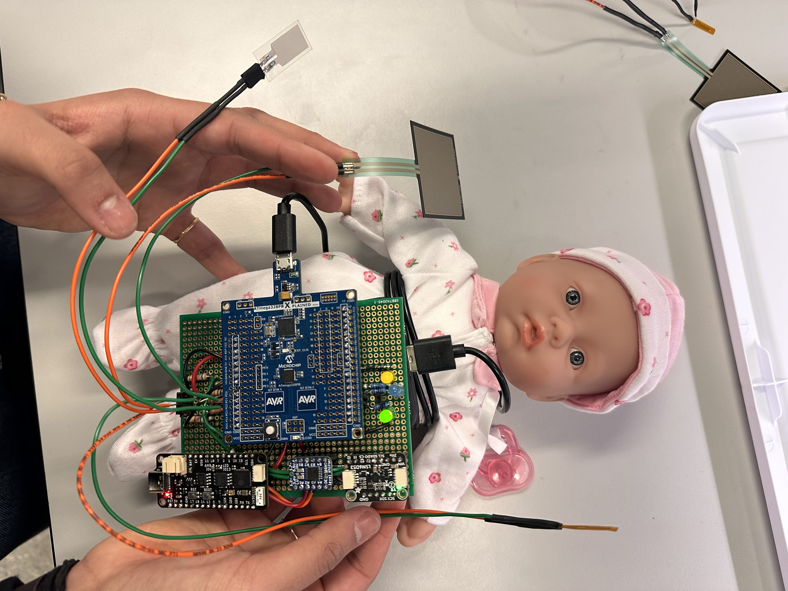

# ssuhaila23.github.io
Baby monitor to detect harmful conditions such as high/low temperature, incorrect position, high/low pressure. or altered breathing.

Group: Arushi Mittal, Ashley Tang, Suhaila Shankar

Description: Baby monitor to detect harmful conditions such as high/low temperature, incorrect position, high/low pressure. or altered breathing.

[Github Repository URL](https://github.com/upenn-embedded/final-project-sids-shield)

Description of Hardware: Macbook M1 Chip, Atmega 328PB, ESP32 Feather Board, level shifter, IMU sensor, Piezoelectric Sensor, Pressure Sensor, Thermistor, Buzzer, LED

### 1. Video

[Final Demo Video](https://drive.google.com/file/d/1bRj_aib5RoBTjQsctpmj98ZeIZh_iGJq/view?usp=sharing)

### 2. Images

### 3. Results

We have a pressure sensor that can determine if the baby is on a hard, soft, or optimal surface. We also have a thermistor to detect and notify if the baby's temperature is too hot or cold. An IMU is used to detect for if the baby flips over. A piezoelectric sensor is used to detect the rise and fall of a baby's chest and hence its breathing patterns. This system has been integrated with LEDs that light up to give a warning sign if a condition is not optimal. We also have the Blynk notification system set up to give mobile alerts for potential risks for the baby. Our project successfully meets the hardware and software requirements. We also used a pcb board to solder the components and ensure that the module is lightweight to be incorporated into a babysuit.

#### 3.1 Software Requirements Specification (SRS) Results

Based on your quantified system performance, comment on how you achieved or fell short of your expected software requirements. You should be quantifying this, using measurement tools to collect data.

* (SRS 01): This SRS indicates that a notification shall be triggered when a baby has been flipped within 5 seconds, and this has been met (the notification is triggered when the baby is flipped, immediately). Our tests have been successful and the notification is sent within a second because flipping the baby causes a negative IMU value. 
* (SRS 02): This SRS defines how the temperature sensor will function, and can alert if baby is not within optimal temperature of between 97.5-99.7 degrees Celsius. 
* (SRS 03): Pressure sensor is able to detect if baby is on soft surface or hard bench. On mattress or a pack of cotton balls ______________
* (SRS 04): This SRS indicates that a notification will be triggered if the baby does not breathe for 5 cycles. Approximately 5 seconds have been used for the 5 breathes and the LED blinks if the piezoelectric does not decrease below a certain voltage to indicate breathing. Our circuit setup has been fixed because we were originally using an op amp to add a gain. However, the piezoelectric generates a voltage, so we did not need an op amp or low pass filter to process the output from the piezoelectric.

#### 3.2 Hardware Requirements Specification (HRS) Results

Based on your quantified system performance, comment on how you achieved or fell short of your expected hardware requirements. You should be quantifying this, using measurement tools to collect data. 

* (HRS 01): An IMU sensor has been implemented with the ability to detect if a baby is facing upwards or downwards with more than 80% accuracy. 
* (HRS 02): A temperature sensor has been implemented with the ability to measure in the ranges of 80℉ -120℉ with at least 95% accuracy.
* (HRS 03): A pressure sensor has been implemented and tests must be done to determine if it can sense weight of baby.
* (HRS 04): A piezoelectric sensor has been implemented to detect baby's breathing. Bottom of piezoelectric sensor is more sensitive than top, so configuration would be ideal if bottom portion of the sensor moves for baby's breathing.

We met our hardware requirements which included using an IMU sensor to detect if the baby flips over, using a thermistor to monitor baby's body temperature, pressure sensor to monitor baby's bed, and piezoelectric to monitor breathing. Our piezoelectric currently measures changes in voltage to detect if the sensor is not moving and shows that the baby has stopped breathing. However, this requires the sensor to be moving with the baby's body which may only give a small change and trigger alerts even though the baby is breathing. We also need to ensure that the electronics are safe and shock resistant for the baby. 

### 4. Conclusion

Reflect on your project. Some questions to consider: What did you learn from it? What went well? What accomplishments are you proud of? What did you learn/gain from this experience? Did you have to change your approach? What could have been done differently? Did you encounter obstacles that you didn’t anticipate? What could be a next step for this project?

We learned how to modularize components of a project, splitting work between team mebers for different sensors and later integrating the sensors into the module. We are proud of our protoboard and second iteration of our design which is clean and able to be placed on top of the baby doll. The wireless component of our project is also seamless and gives instant notifications for high temperature, pressure, flipped baby, or stoppped breathing. We learned how to debug code when integrating different components and hardware debugging such as using an oscilloscope and multimeter to measure if a signal is being sent or the op amp performs the expected amplification. 

